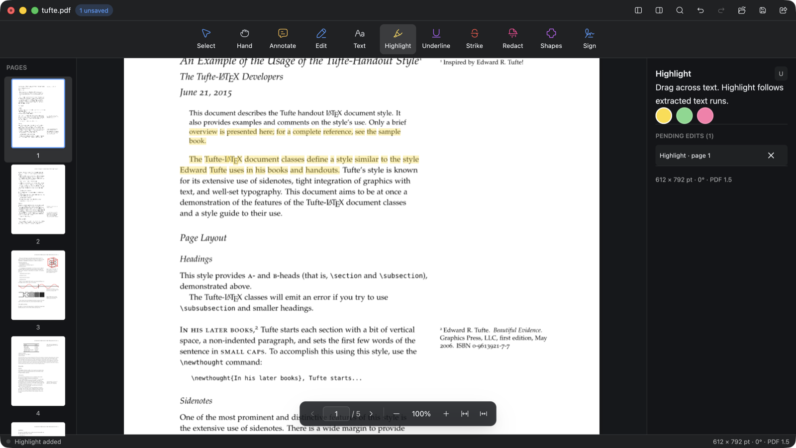

<div align="center">
  
  <h1>GPUI PDF</h1>
  <p>A local-first PDF reader and editor written in Rust, drawn with GPUI.</p>
</div>



Every page is rendered, edited and saved on your machine. Nothing is uploaded,
no account is involved, and the file you open is the file you keep: edits go to
a sibling temporary file and are swapped in atomically, so a crash mid-save
cannot leave a half-written PDF behind.

The PDF backend sits behind a trait boundary (`pdf-engine`), with
[zpdf](https://github.com/Xero-Team/zpdf) as the current implementation. The UI
crate never links a PDF library, so the engine can be swapped without touching
the interface.

## What it does today

- Reads and navigates documents with a thumbnail sidebar, continuous scrolling,
  pinch and trackpad panning, zoom, fit-page and fit-width.
- Selects text against real extracted glyph geometry, character by character and
  across page boundaries.
- Highlights, underlines and strikes text, and adds notes, shapes, signatures
  and free text placed directly on the page.
- Fills existing AcroForm fields in place, over their real widget rectangles.
- Redacts regions by removing the underlying content, then rewriting the file
  fresh so earlier revisions do not survive in the saved copy.
- Saves in place or as a copy, with full undo and redo of pending edits.

Where the engine falls short — form limits, redaction scope, encrypted files —
the gaps are listed in [`docs/pdf-compatibility.md`](docs/pdf-compatibility.md).
Read that page before trusting a redaction with anything sensitive.

## Install with Homebrew

This repository is its own Homebrew tap: the cask lives in
[`Casks/gpui-pdf.rb`](Casks/gpui-pdf.rb) and every tagged release publishes an
app bundle tarball for Apple Silicon and Intel.

```sh
brew tap list-jonas/gpui-pdf https://github.com/list-jonas/gpui-pdf
brew trust --tap list-jonas/gpui-pdf
brew install --cask --no-quarantine list-jonas/gpui-pdf/gpui-pdf
```

`brew trust` is required because Homebrew refuses to load formulae and casks
from third-party taps until you say you trust them. Revoke it later with
`brew untrust --tap list-jonas/gpui-pdf`.

`--no-quarantine` is required because the released bundle is ad-hoc signed, not
Developer ID signed or notarized. Without it Gatekeeper refuses to open the app.

Upgrade and removal work the usual way:

```sh
brew upgrade --cask gpui-pdf
brew uninstall --cask gpui-pdf
```

## Run it

Requires Rust 1.97.1, which the checked-in toolchain file will pick up for you.

```sh
cargo run -p gpui-pdf -- /absolute/path/to/document.pdf
```

No path is fine too — `Cmd+O` opens a file picker. `Cmd+S` saves in place and
`Cmd+Shift+S` writes a copy.

If you want a document to try it on, the
[Tufte-LaTeX handout](https://github.com/Tufte-LaTeX/tufte-latex/blob/master/sample-handout.pdf)
is a good one: sidenotes, figures and dense typography give both the text
extraction and the renderer something to chew on. It is the document in the
screenshot above.

```sh
curl -L -o handout.pdf https://raw.githubusercontent.com/Tufte-LaTeX/tufte-latex/master/sample-handout.pdf
cargo run -p gpui-pdf -- "$PWD/handout.pdf"
```

## Shortcuts

| Action | Shortcut |
| --- | --- |
| Open / Save / Save As | `Cmd+O` / `Cmd+S` / `Cmd+Shift+S` |
| Undo / Redo | `Cmd+Z` / `Cmd+Shift+Z` |
| Find / Next / Previous | `Cmd+F` / `Cmd+G` / `Cmd+Shift+G` |
| Scroll | `↑` / `↓`, `Space` / `Shift+Space`, `PageUp` / `PageDown` |
| Document start / end | `Home` / `End` |
| Page back / forward | `←` / `→` (or `Cmd+←` / `Cmd+→`) |
| First / Last / Go to page | `Cmd+↑` / `Cmd+↓` / `Cmd+J` |
| Zoom in / out | `Cmd+=` / `Cmd+-` |
| Actual size / Fit page / Fit width | `Cmd+0` / `Cmd+1` / `Cmd+2` |
| Copy / Select all text | `Cmd+C` / `Cmd+A` |
| Delete selected annotation | `Delete` / `Backspace` |
| Toggle thumbnails / properties | `Cmd+Ctrl+S` / `Cmd+Alt+0` |
| Cancel current action | `Esc` |
| Tools | `V` select, `H` hand, `E` edit, `U` highlight, `L` underline, `K` strike, `T` text, `N` comment, `S` sign, `G` shape, `R` redact |

Editing and navigation keys are ignored while a text field has focus, so typing
never scrolls the page or deletes an annotation. `Esc` always works: it leaves
the field first, then clears the selection, then returns to the select tool.

Dragging with the select, highlight, underline or strike tools continues across
page boundaries, and `Cmd+A` selects the whole document.

## macOS app bundle

```sh
./scripts/package-macos.sh
open "dist/GPUI PDF.app"
```

The bundle registers as a PDF editor, so it shows up in Finder's Open With menu
and handles double-clicked files. Local builds are ad-hoc signed; shipping it to
anyone else needs Developer ID signing and notarization.

## Layout

```text
crates/app                 window, menus, session state
crates/ui                  GPUI views and elements, no PDF dependency
crates/rendering           render worker and generation tracking
crates/pdf-engine          backend-independent read/render/edit contracts
crates/pdf-engine-zpdf     zpdf implementation of those contracts
crates/document-core       IDs, geometry, viewport maths
crates/persistence         the only crate that writes user files
```

Dependencies flow one way and are described in
[`docs/architecture.md`](docs/architecture.md).

## Contributing

```sh
./scripts/verify.sh
```

That runs fmt, check, test and clippy with warnings denied, and it must pass
before a commit. [`CONTRIBUTING.md`](CONTRIBUTING.md) covers the extra steps
for dependency changes. Scope and delivery phases live in
[`plans/001-adobe-acrobat-alternative.md`](plans/001-adobe-acrobat-alternative.md).

## License

MIT or Apache-2.0, at your option.
