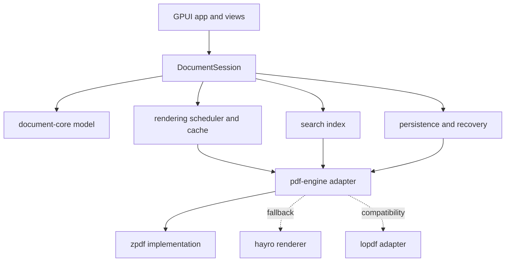

# Plan 001: Build a local-first Acrobat alternative with Rust + GPUI

> **Executor instructions**: This is a greenfield product plan. Follow phases
> in order. Keep PDF-engine code independent from GPUI. Do not start true
> arbitrary-PDF text editing before the engine spike proves stable text-to-PDF
> mapping. Run every verification gate. If a STOP condition occurs, report it
> instead of inventing a workaround.

> **Drift check**: Plan written against an empty workspace with no Git
> repository and no commit SHA. Before implementation, inspect the current
> tree. If a `Cargo.toml`, source directory, design document, or Git history
> now exists, reconcile this plan with those artifacts before changing code.

## Status

- **Priority**: P1
- **Effort**: XL; multi-month product, not one feature
- **Risk**: HIGH; PDF compatibility and editing semantics are difficult
- **Depends on**: none
- **Category**: direction
- **Planned at**: no Git repository, 2026-08-19

## Why this matters

Goal: build native, local-first PDF software with Acrobat-class workflow value,
without Electron or cloud dependency. First release should be excellent at
reading, annotating, organizing, filling, and safely saving PDFs. Full
Word-like editing of arbitrary PDFs is explicitly later work; promising it in
v1 would create major compatibility and data-integrity risk.

Product advantage: fast native UI, private local files, keyboard-friendly
workflow, predictable open formats, and a Rust implementation that can share
engine code across platforms.

## Current state and ecosystem constraints

The repository is empty. No application architecture, build command, tests,
design system, dependency policy, or license policy exists yet.

Relevant current projects:

- [GPUI](https://gpui.rs/) is the UI framework. It provides application/window
  APIs, declarative views, custom elements, input, scrolling, and GPU-backed
  composition. It is not a PDF parser or writer.
- [`gpui-component`](https://github.com/longbridge/gpui-component) is the
  preferred styled UI layer. It currently provides 60+ cross-platform
  components, themes, dock layouts, virtualized lists/tables, dialogs, inputs,
  menus, tooltips, and an Apache-2.0 license. Use its components for app chrome;
  keep the PDF page canvas custom.
- [`zpdf`](https://github.com/Xero-Team/zpdf) is the recommended first engine
  candidate. It currently advertises pure-Rust parsing, CPU/GPU rendering,
  text extraction, forms, annotations, page operations, redaction, merging,
  signing, and a GPUI reader. MIT license.
- [`hayro`](https://github.com/LaurenzV/hayro) is a strong pure-Rust renderer
  candidate with broad PDF regression coverage. Its own project describes
  rendering as the main scope; it is not the complete editing backend.
- [`lopdf`](https://github.com/J-F-Liu/lopdf) is a mature MIT PDF manipulation
  library. It may cover compatibility gaps, but it does not replace a render
  pipeline. Keep it behind an adapter if used.
- [`gpui-pdf`](https://github.com/packetThrower/zorite/tree/main/crates/gpui-pdf)
  demonstrates page virtualization, search, highlights, and form interaction
  in GPUI. It is GPL-3.0-or-later and should not become a default dependency
  unless product licensing intentionally accepts GPL.

### Architecture decisions

Recommended defaults:

1. Desktop-first, local-first, no mandatory account or network service.
2. Use official GPUI plus `gpui-component` as default. Pin a compatible GPUI
   revision and `gpui-component` revision together; its current usage points at
   the Zed GPUI repository. Consider GPUI-CE only after a compatibility spike
   proves `gpui-component` works with it. Never mix GPUI sources in one build.
3. Use `gpui-component` for shell controls, dock/split layout, tabs, dialogs,
   menus, command palette, lists, tables, forms, and theme tokens. Implement
   `PdfCanvas`, annotation overlays, and page thumbnails as product-owned
   custom elements where component-library controls do not fit.
4. Put `zpdf` behind an internal `pdf-engine` adapter. Start CPU-rasterized;
   let GPUI handle compositing. Add direct GPU PDF rendering only after a
   benchmark proves CPU raster/upload is a bottleneck.
5. Keep the app's canonical edit model separate from PDF object dictionaries.
   UI, undo/redo, selection, and annotations must not depend on `zpdf` or
   `lopdf` types.
6. Prefer permissive dependencies (MIT/Apache-2.0). Perform license and
   security review before locking dependencies for distribution.
7. Treat PDFs as hostile input: no JavaScript execution, no automatic external
   resource fetches, bounded parsing/rendering, and no silent data loss.

## Product definition

### Target users

- Researchers and students reading, searching, and annotating papers.
- Developers and technical users who want a fast keyboard-driven native tool.
- Small businesses handling forms, invoices, contracts, and page assembly.
- Privacy-sensitive users who want files processed locally.

### Product promise

“Open, understand, mark up, organize, fill, sign, and export PDFs locally in a
fast native app.”

### Deliberate non-goals for first release

- Cloud storage, accounts, collaboration, comments sync, or telemetry by
  default.
- PDF JavaScript execution, embedded browser content, or automatic network
  fetches.
- Guaranteed Word-like editing of every existing PDF.
- DRM circumvention or password cracking.
- Replacing a full desktop publishing application.

## Feature set

Priority meanings: P0 is release-blocking, P1 is next release value, P2 is
advanced capability, and DEFER means do not design around it yet.

### P0: reader foundation

- Open local PDF through file picker, drag-and-drop, command-line path, and
  “Open With”.
- Recent documents and reopen-last-session state, with paths only; never store
  document contents in app metadata.
- Page-virtualized continuous scroll with bounded memory.
- Page thumbnails and current-page indicator.
- Zoom: fit width, fit page, explicit percentage, keyboard shortcuts, and
  mouse/trackpad pan.
- Page rotation for viewing.
- Outline/bookmark sidebar and internal/external link activation.
- Text selection, copy, and selection-aware search.
- Search bar with match count, next/previous match, match highlighting, and
  page navigation.
- Password prompt for encrypted files; clear locked, loading, failed, and
  unsupported states.
- Document metadata and page count.
- Print/export through platform integration only after basic save is stable.

### P0: document organization

- Reorder pages by drag-and-drop.
- Delete pages with confirmation and undo.
- Rotate pages persistently.
- Insert blank page.
- Insert pages from another PDF.
- Duplicate page.
- Extract selected pages into a new PDF.
- Merge PDFs into a new document.
- Split by page ranges.
- Save As; never overwrite the original without explicit confirmation.

### P0: annotations and markup

- Highlight, underline, strikeout.
- Freehand pen and eraser.
- Line, arrow, rectangle, ellipse, and callout.
- Text box with configurable font size/color.
- Sticky note/comment.
- Image/stamp placement.
- Annotation selection, move, resize, recolor, duplicate, delete, and flatten.
- Annotation list/sidebar with page navigation.
- Undo/redo for every annotation and page operation.
- Store annotation geometry in PDF page coordinates, not screen pixels.

### P0: safe persistence

- Dirty-state indicator and close-with-unsaved-changes prompt.
- Atomic save through sibling temporary file followed by rename.
- Save failure leaves original file intact and exposes actionable error.
- Incremental save where engine supports it; full rewrite fallback.
- Autosave edit journal/recovery file in app data directory, not beside the
  user's PDF unless explicitly chosen.
- Recovery prompt after crash; delete recovery data only after successful save
  or explicit dismissal.
- Signed-document warning: any edit can invalidate a digital signature.

### P1: forms, print, and signing

- AcroForm text, checkbox, radio, and choice fields.
- Tab order and keyboard form navigation.
- Form reset, validation feedback, and export of filled form.
- Import/export form data where engine support is reliable.
- Print preview and platform print dialog.
- Visible drawn signature/stamp.
- Digital signature creation and verification with explicit certificate/key
  selection. Never silently sign or persist private-key material.
- Signature status panel: valid, invalidated by edit, unknown trust, or
  verification unavailable.

### P1: redaction and review

- Redaction marks with a separate review state.
- Preview redactions before commit.
- True redaction that removes intersecting text/images/paths/annotations from
  output, not a white rectangle.
- Optional replacement text and redaction color.
- Final “redaction applied” confirmation and post-save search check.
- Review mode: annotation author, timestamp, color, and comments.

### P2: document production

- Image import from clipboard/file.
- Crop and page boxes.
- Header/footer and page numbering stamps.
- Optimize/compress with before/after size report.
- PDF/A validation and export warnings.
- Compare two PDFs visually and textually.
- OCR pipeline for scanned PDFs, behind an optional local provider.
- Accessibility inspection: tagged PDF status, reading order warnings, and
  keyboard-complete navigation.
- Batch operations over a selected file list.

### P2/DEFER: content editing

Implement in two layers:

1. Overlay editing: cover selected content or region, place new text/image,
   preserve original as a separate history state, and clearly label result as
   an overlay/replacement.
2. Semantic editing: modify original text/image/vector objects only when the
   engine can map rendered selections to stable source objects and preserve
   layout. Unsupported pages must disable the tool instead of producing a
   misleading result.

Do not expose a generic “edit text” button until both mapping and save output
  pass a corpus of multilingual, rotated, subset-font, ligature, and scanned
  PDFs.

## Recommended architecture

### Project structure

Use a Cargo workspace. `app` is the only binary crate. All other crates are
libraries with narrow responsibilities and no UI side effects.

```text
gpui-pdf/
├── Cargo.toml                    # workspace members, shared versions/lints
├── Cargo.lock                    # committed for reproducible desktop builds
├── rust-toolchain.toml           # pinned stable toolchain
├── rustfmt.toml
├── deny.toml                     # licenses, advisories, banned sources
├── README.md
├── CONTRIBUTING.md
├── SECURITY.md
├── LICENSE-APACHE
├── LICENSE-MIT
├── assets/
│   ├── icons/                    # Lucide/custom SVG names used by Icon
│   ├── fonts/                    # only redistributable fonts
│   └── fixtures/                 # tiny licensed PDFs only
├── docs/
│   ├── architecture.md
│   ├── product-scope.md
│   ├── pdf-compatibility.md
│   ├── security-model.md
│   └── adr/
├── crates/
│   ├── app/                      # binary: application composition only
│   │   └── src/
│   │       ├── main.rs
│   │       ├── app.rs             # gpui application + gpui_component::init
│   │       ├── actions.rs         # keyboard/menu actions
│   │       ├── commands.rs        # command routing, not PDF mutation
│   │       ├── settings.rs
│   │       ├── workspace.rs       # tabs, windows, recent paths
│   │       ├── session/
│   │       │   ├── document_session.rs
│   │       │   ├── document_worker.rs
│   │       │   └── events.rs
│   │       ├── windows/
│   │       │   ├── main_window.rs
│   │       │   ├── preferences_window.rs
│   │       │   └── dialogs.rs
│   │       └── features/
│   │           ├── reader.rs
│   │           ├── pages.rs
│   │           ├── annotations.rs
│   │           ├── forms.rs
│   │           ├── search.rs
│   │           ├── review.rs
│   │           └── signatures.rs
│   ├── ui/                       # product UI built on gpui-component
│   │   └── src/
│   │       ├── lib.rs
│   │       ├── theme.rs           # project tokens mapped to ThemeColor
│   │       ├── shell/
│   │       │   ├── top_bar.rs
│   │       │   ├── sidebars.rs
│   │       │   ├── status_bar.rs
│   │       │   └── command_palette.rs
│   │       ├── pdf/
│   │       │   ├── pdf_canvas.rs  # custom element; page pixels + overlays
│   │       │   ├── page_slot.rs
│   │       │   ├── page_thumbnail.rs
│   │       │   ├── annotation_overlay.rs
│   │       │   └── selection_layer.rs
│   │       └── components/
│   │           ├── loading_view.rs
│   │           ├── error_view.rs
│   │           ├── property_panel.rs
│   │           └── unsaved_changes_dialog.rs
│   ├── document-core/             # no GPUI, no PDF-library imports
│   │   └── src/
│   │       ├── lib.rs
│   │       ├── ids.rs
│   │       ├── model.rs
│   │       ├── geometry.rs
│   │       ├── selection.rs
│   │       ├── annotations.rs
│   │       ├── forms.rs
│   │       ├── operations.rs
│   │       ├── history.rs
│   │       ├── capabilities.rs
│   │       └── error.rs
│   ├── pdf-engine/                # project-owned traits and value types
│   │   └── src/
│   │       ├── lib.rs
│   │       ├── reader.rs
│   │       ├── renderer.rs
│   │       ├── editor.rs
│   │       ├── signer.rs
│   │       ├── types.rs
│   │       └── error.rs
│   ├── pdf-engine-zpdf/            # default zpdf implementation
│   │   └── src/{lib.rs,reader.rs,renderer.rs,editor.rs,signer.rs,convert.rs}
│   ├── rendering/                 # scheduling/cache, no GPUI business logic
│   │   └── src/{lib.rs,layout.rs,scheduler.rs,cache.rs,texture_upload.rs}
│   ├── persistence/               # save/export/recovery only
│   │   └── src/{lib.rs,save.rs,atomic_write.rs,recovery.rs,export.rs}
│   ├── search/                    # extraction/index/query state
│   │   └── src/{lib.rs,index.rs,query.rs,match_geometry.rs}
│   ├── platform/                  # OS-specific integration
│   │   └── src/{lib.rs,files.rs,clipboard.rs,printing.rs,security.rs}
│   └── test-support/              # shared fixture and golden-test helpers
│       └── src/lib.rs
├── tests/
│   ├── fixtures/                  # generated/downloaded only with license note
│   ├── golden/                    # approved render baselines
│   ├── integration/
│   └── fuzz/
└── scripts/
    ├── verify.sh
    ├── render-fixtures.sh
    └── check-licenses.sh
```

Do not create every file on day one. Create the workspace, `app`, `ui`,
`document-core`, `pdf-engine`, `pdf-engine-zpdf`, `rendering`, `persistence`,
and `test-support` first. Add `search`, `platform`, and feature modules as
their behavior becomes real.

### Dependency direction

```text
app
 ├── ui ──────────────── gpui + gpui-component + document-core
 ├── document-core
 ├── rendering ───────── document-core + pdf-engine
 ├── persistence ────── document-core + pdf-engine
 ├── search ──────────── document-core + pdf-engine
 └── platform

pdf-engine-zpdf ──────── pdf-engine + zpdf
test-support ─────────── document-core + pdf-engine
```

Hard rules:

- `document-core` must compile without GPUI, `gpui-component`, or any PDF
  library.
- `ui` may use `gpui-component`; it may render project-owned models but must
  not call `zpdf` directly.
- `app` composes features and routes actions. It must not contain PDF parsing,
  coordinate math, or save serialization.
- `pdf-engine-zpdf` is replaceable. A future `pdf-engine-hayro` or
  `pdf-engine-lopdf` must implement the same project-owned interfaces.
- `rendering` owns page scheduling/cache policy. `ui::pdf::pdf_canvas` owns
  painting and pointer interaction, not rasterization.
- `persistence` is the only crate allowed to write user PDF files.
- Product-specific styled components belong in `ui`; generic behavior should
  use `gpui-component` rather than being reimplemented.

### GPUI Component integration

Call `gpui_component::init(cx)` once during application startup before using
component features. Wrap the main view with the library's `Root` so theme,
focus, dialogs, and component context work consistently.

Use `gpui-component` directly for:

- `Root`, theme initialization, and `ThemeColor` tokens;
- `Dock`/split layout for thumbnail, outline, annotation, and properties panes;
- buttons, icon buttons, menus, toolbars, tabs, dialogs, popovers, tooltips,
  context menus, checkboxes, radios, switches, sliders, and inputs;
- virtualized `List`/`Table` for thumbnails, search results, annotation lists,
  form fields, and batch-operation files;
- command palette and keyboard-driven navigation where available;
- progress, toast, notification, and error presentation.

Do not force the PDF page into a generic `List` or `Table`. `PdfCanvas` needs
custom layout and texture painting because it must coordinate page geometry,
virtualized raster work, selection, annotations, forms, and pointer mapping.
Use `gpui-component` around it for the shell and controls.

Theme rule: define product tokens once in `ui/src/theme.rs`, map them to the
component theme, and pass colors into the PDF canvas/overlay through a small
`PdfStyle` value. Do not hardcode separate colors in feature modules.

Compatibility gate: `gpui-component` currently documents a Git-based GPUI
dependency. Before implementing features, pin a known-compatible pair in the
workspace and verify macOS, Linux, and Windows builds. Do not upgrade GPUI and
`gpui-component` independently.

### Layer boundaries



Rules:

- GPUI types stay in `app` and `ui`; engine crates must compile without GPUI.
- `document-core` owns stable IDs, commands, coordinate transforms, dirty
  state, and capabilities. It must not import a PDF library.
- `pdf-engine` exposes project-owned types and `Result` errors. No `zpdf`,
  `hayro`, or `lopdf` type crosses its public boundary.
- Only `persistence` may serialize edits to disk.
- Only `DocumentWorker`/engine adapter may mutate engine document state.
- UI receives events/results; UI never blocks on parsing, rendering, search,
  OCR, or save.

### Engine strategy

Define separate read/render/write capabilities instead of one giant trait:

```text
PdfReader
  open, password status, page metadata, outline, links, text runs, forms

PdfRenderer
  render page/region at requested scale and rotation

PdfEditor
  annotations, forms, page operations, merge/split, metadata, redaction

PdfSigner
  inspect signatures, verify, create signature
```

The adapter reports `EngineCapabilities`; UI disables unsupported commands and
explains why. This avoids pretending every engine can perform every operation.

Default implementation: `zpdf` adapter. Use CPU rendering first. Add a hayro
render adapter or lopdf compatibility adapter only behind tests that identify
a concrete zpdf gap. Do not maintain two independent canonical writers.

### Document worker and concurrency

Each open document gets one worker/actor that owns mutable engine state. GPUI
holds a lightweight session and sends messages:

```text
Open(path/bytes)
Unlock(password)
Render(page_id, render_request, generation)
ExtractText(page_id)
Apply(engine_edit)
Save(save_options)
Close
```

Worker emits:

```text
Opened(metadata)
PageRendered(page_id, cache_key, pixels, generation)
TextReady(page_id, runs)
EditApplied(revision)
SaveFinished(path, revision)
Failed(operation, structured_error)
```

Requirements:

- UI thread never waits synchronously for PDF work.
- Every async result carries a document/revision/generation ID. Drop stale
  render/search results.
- Render jobs are cancellable or generation-invalidated.
- Save serializes edits in command order.
- Close cancels work, releases textures, then drops the worker.

### Canonical document model

Use stable IDs independent of PDF object numbers:

```text
DocumentId
PageId
AnnotationId
FormFieldId
RevisionId
```

Core model fields:

- ordered `Vec<PageId>` plus page metadata map;
- original source identity and current revision;
- per-page PDF geometry: MediaBox, CropBox, rotation, user unit;
- annotations and form fields keyed by stable IDs;
- selection expressed as page ID plus PDF-space rectangles/quads;
- dirty/save state;
- command history and redo stack;
- engine capability snapshot.

Coordinate rules:

- Persist geometry in PDF points using canonical page coordinates.
- Convert PDF-space → viewport-space in one tested transform module.
- Account for CropBox, rotation, page scale, device pixel ratio, and zoom.
- Use quadrilaterals for text highlights; rectangles are insufficient for
  rotated or multi-line text.
- Never persist screen pixels.

### Command and undo model

Represent user edits as semantic commands, not byte snapshots:

```text
InsertPages
DeletePages
ReorderPages
RotatePages
AddAnnotation
UpdateAnnotation
DeleteAnnotation
SetFormValue
ApplyRedaction
SetMetadata
```

Each command has `apply`, `inverse`, affected IDs, and a user-facing label.
Group drag operations, freehand strokes, and multi-page changes into one
transaction. Keep original bytes plus command history until save; do not copy a
whole 500-page document for each undo step.

### Rendering pipeline

1. Layout page slots from page dimensions before rasterizing.
2. Determine visible pages plus a small prefetch window.
3. Schedule raster jobs off-thread.
4. Cache by:
   `document_revision + page_id + zoom_bucket + dpi + rotation + render_mode`.
5. Upload finished pixels to GPUI textures on the UI side.
6. Paint annotation/form/selection overlays in the same page transform.
7. Evict off-screen textures with a byte budget and retain small thumbnails.

Start with full-page raster images. Add tiled rendering only after benchmarks
show high-zoom pages exceed the memory or upload budget. Target behavior:

- 100-page typical document remains bounded in memory.
- Scrolling never blocks the UI.
- Zoom keeps old bitmap visible until replacement is ready.
- A stale render can never replace a newer revision's page.

### Persistence and recovery

Save flow:

```text
validate model
  -> build engine edit transaction
  -> serialize to sibling temp file
  -> flush/close temp
  -> atomically rename temp over destination
  -> mark revision saved
  -> remove recovery journal
```

Rules:

- Keep source file untouched until successful final rename.
- Preserve file permissions where platform APIs allow.
- Return structured errors for permission, disk-full, invalid-PDF, and
  unsupported-feature failures.
- Record autosave journal by command/revision, not plaintext passwords.
- Save a copy before destructive redaction or flattening if user requests it.
- Signed PDFs open read-only by default after signature inspection; editing
  requires explicit confirmation and creates an invalidation warning.

### Security and robustness

- Treat every PDF as untrusted binary input.
- Bound page count, object count, decoded stream size, image dimensions,
  recursion depth, render time, and total cache memory.
- No JavaScript execution.
- No automatic network access from links, forms, attachments, or metadata.
- External links require explicit user activation and safe platform handling.
- Do not execute or preview embedded files automatically.
- Passwords live only for the active unlock/save operation unless user opts
  into a platform credential store; never log them.
- Redaction tests must prove removed content cannot be found or extracted.
- Add fuzz targets for parser/open, page render, annotation import, and save.
- Run dependency/license/advisory checks before each distributable release.

### UI architecture

Primary window:

```text
AppWindow
  TopBar: file actions, undo/redo, search, zoom, active tool
  MainSplit
    LeftSidebar: thumbnails | outline | annotations | forms
    Center: virtualized PdfCanvas
    RightSidebar: properties, comments, signature/redaction review
  StatusBar: page, zoom, save state, signature state
```

Use GPUI actions for keyboard commands and route them through
`CommandRouter`. Do not let individual buttons mutate the document directly.
Every mutation must produce a command, history entry, dirty-state update, and
accessible status message.

Accessibility baseline:

- All actions have keyboard bindings and visible labels/tooltips.
- Focus order works across toolbar, sidebar, page canvas, and dialogs.
- Search and form fields expose current state to assistive technology where
  GPUI platform support allows.
- Do not make color the only annotation distinction.

## Delivery roadmap

Effort is coarse and assumes one experienced Rust developer; validate after the
engine spike.

### Phase 0 — product and engine spike (S/M)

Deliver a tiny GPUI + `gpui-component` window that initializes the component
theme/root, opens one PDF, renders one page, reports page metadata, and exits
cleanly. Pin Rust, GPUI, `gpui-component`, and engine revisions. Test at least
one text PDF, one scanned/image PDF, one rotated PDF, one encrypted PDF, and
one malformed PDF.

Exit criteria:

- Engine can render representative fixtures without UI blocking.
- `gpui-component` builds against the pinned GPUI revision on target platforms.
- Main view uses `Root`; component theme initialization happens once at app
  startup.
- Text extraction, page geometry, and coordinate transforms are understood.
- Dependency licenses are compatible with intended distribution.
- Decision recorded: zpdf adapter accepted, or a concrete fallback selected.

Verification:

```text
cargo fmt --all -- --check
cargo check --workspace
cargo test --workspace
cargo clippy --workspace --all-targets -- -D warnings
```

### Phase 1 — reader foundation (M)

Implement file open, loading/error states, page layout, virtualized scrolling,
zoom, thumbnails, navigation, rotation, copy, outline, links, and password
prompt.

Exit criteria:

- 100-page fixture opens and scrolls without unbounded texture growth.
- UI remains responsive while pages render.
- Stale/cancelled render results do not alter current document view.
- Search and outline navigation land on correct pages.

### Phase 2 — document operations (M/L)

Implement page model and commands for insert, delete, duplicate, reorder,
rotate, extract, merge, split, and metadata. Add transactional undo/redo.

Exit criteria:

- Every operation has unit tests for apply/inverse.
- Page IDs remain stable through reorder/delete/undo.
- Save/reopen produces expected page order and metadata.

### Phase 3 — annotations and markup (L)

Implement annotation model, page-space transforms, selection, text quads,
highlight/underline/strikeout, pen, shapes, text boxes, notes, stamps, and
annotation sidebar. Add flattened-export option.

Exit criteria:

- Overlay aligns at multiple zoom levels, rotations, and DPI values.
- Reopen preserves annotation geometry and appearance.
- Drag/freehand actions collapse into sensible single undo entries.

### Phase 4 — forms and safe persistence (L)

Implement AcroForm field model, keyboard navigation, field editing, save/export,
atomic writes, recovery journal, save errors, and signed-document warnings.

Exit criteria:

- Filled forms render correctly after reopening in another PDF reader.
- Crash/recovery test restores unsaved command history.
- Failed save leaves destination file byte-identical.

### Phase 5 — review, redaction, print, signing (L/XL)

Add redaction review/commit, true content removal, print integration, visible
signatures, digital-signature verification/creation, and trust-state UI.

Exit criteria:

- Redacted text/images/annotations are absent from output extraction and render.
- Edits to signed documents clearly report signature invalidation.
- Signature verification tests use known fixtures and never trust UI labels alone.

### Phase 6 — advanced production features (XL)

Add OCR, compare, optimization, PDF/A, accessibility inspection, batch work,
and content editing pilots. Each feature gets an engine capability flag and a
fixture corpus before UI exposure.

## Initial implementation backlog

Execute in this order:

1. Create Cargo workspace, choose Rust edition/MSRV, pin compatible GPUI and
   `gpui-component` revisions, add formatting/lint/test commands, and create a
   minimal window using `gpui_component::init(cx)` plus `Root`.
2. Add `document-core` types: IDs, page geometry, coordinate transforms,
   capability flags, dirty state, command trait, and structured errors.
3. Add `pdf-engine` traits and a zpdf adapter. Keep GPUI out of the crate.
4. Add `DocumentWorker` protocol and a one-document session.
5. Render one page into a GPUI texture; add generation IDs and cancellation.
6. Build `PdfCanvas` with page slots, scroll, zoom, fit modes, and bounded LRU
   cache.
7. Add file picker, drag/drop, loading states, password prompt, and recent
   paths.
8. Add thumbnails, page navigation, outline, links, text extraction, and
   search.
9. Add command history and page operations; test save/reopen.
10. Add annotation overlays and annotation serialization.
11. Add atomic save and recovery journal.
12. Add forms, then redaction, print, signatures, and advanced editing only
    after earlier exit criteria pass.

## Verification and quality gates

### Required commands after scaffold

The project must provide these commands and keep them green:

```text
cargo fmt --all -- --check
cargo check --workspace
cargo test --workspace
cargo clippy --workspace --all-targets -- -D warnings
```

Add these before distributable builds:

```text
cargo test --workspace --release
cargo deny check licenses advisories bans sources
```

If `cargo-deny` is not adopted, replace it with an equivalent checked-in
license/advisory tool and document the exact command in `CONTRIBUTING.md`.

### Test layers

- `document-core` unit tests: coordinate transforms, page rotation, selection
  quads, command inverses, transaction grouping, dirty state.
- Engine integration tests: open/render/extract/save representative fixtures.
- Golden render tests: compare page renders with a documented pixel tolerance;
  include text, image, transparency, rotation, crop, and malformed fixtures.
- Property tests: random legal page-operation sequences followed by inverse
  sequence restore original model.
- Persistence tests: atomic save failure, recovery replay, password handling,
  signed-document warning, reopen after each operation class.
- Security tests: bounded resource input, no panic/hang, no network or script
  execution, true-redaction extraction checks.
- GPUI tests: command routing, focus order, keyboard shortcuts, stale render
  suppression, close/cancel cleanup.
- Cross-platform CI: macOS, Linux, Windows; CPU render path must work on all.

### Performance targets to measure

These are initial targets, not claims. Record hardware and fixture size in
benchmarks:

- First visible page appears quickly for a normal local document.
- Open/parse work never blocks GPUI event processing.
- 100-page scrolling keeps memory within an explicit configured cache budget.
- Search index creation runs off-thread and reports progress for large files.
- Zooming reuses old bitmap until new render completes.
- Page operation and annotation edits feel immediate before save serialization.

## Scope boundaries

### In scope for implementation

- New Rust workspace and GPUI desktop application.
- Local PDF open/read/search/annotate/organize/fill/save workflow.
- Backend-independent document model and engine adapter.
- Tests, fixtures, benchmarks, license policy, and recovery behavior.

### Explicitly out of scope until separately approved

- Cloud sync, login, collaboration, telemetry, or server-side PDF processing.
- JavaScript/embedded web execution.
- Automatic external-resource loading.
- Copying GPL code into a differently licensed product.
- Full arbitrary-PDF text editing before engine mapping evidence exists.
- Mobile/web targets before desktop engine and file safety are stable.

## STOP conditions

Stop and report if:

- The selected GPUI source cannot build on one of the target platforms without
  an unreviewed fork or broad source patch.
- The selected PDF engine cannot render the fixture corpus or has an
  incompatible license; do not silently substitute a second writer.
- PDF engine objects are not safely usable from the planned worker model;
  redesign ownership/concurrency before adding UI state.
- A feature requires mutating raw PDF bytes without a tested object/appearance
  model, especially text editing or redaction.
- A save operation could overwrite the original before successful serialization.
- A security, signature, redaction, or licensing claim cannot be demonstrated
  by a regression test or documented limitation.
- A change needs files outside the current phase's scope; update the plan first.

## Done criteria for the first public alpha

- [ ] Local PDFs open on macOS, Linux, and Windows.
- [ ] Reader supports page virtualization, zoom, navigation, thumbnails,
      search, outline, links, copy, and password prompt.
- [ ] Page operations and core annotations work with undo/redo.
- [ ] Save is atomic; failed save preserves original; recovery is tested.
- [ ] Forms are either supported or clearly capability-gated with no silent
      data loss.
- [ ] PDFs are never executed, fetched, or uploaded by default.
- [ ] Redaction is not advertised until true-removal tests pass.
- [ ] `cargo fmt`, `cargo check`, `cargo test`, and strict `cargo clippy` pass.
- [ ] License/advisory review is documented.
- [ ] Known unsupported PDF features and engine limitations are visible to
      users and documented.

## Maintenance notes

- Pin GPUI, `gpui-component`, and PDF-engine revisions. Upgrade them in isolated
  branches with
  fixture and render-regression runs.
- Keep engine adapters thin. If UI code starts importing engine types, reject
  the change and extend the project-owned boundary instead.
- Treat page geometry and coordinate transforms as critical infrastructure;
  every new annotation/content tool depends on them.
- Every new writer capability needs round-trip tests and tests against at
  least one independent PDF reader.
- Review all changes involving passwords, signatures, redaction, embedded
  files, external links, and save paths as security-sensitive.
- Revisit true text editing only after engine source-object mapping is proven
  on multilingual, rotated, subset-font, ligature, and scanned PDFs.
